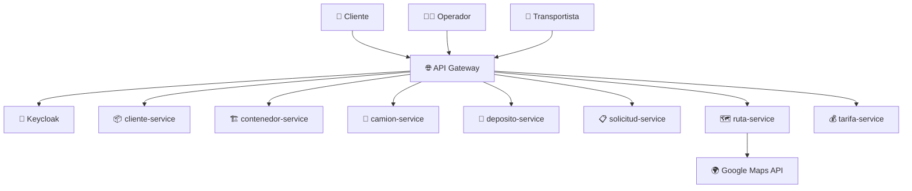

# 🚛 TPI-Backend: Sistema de Gestión de Transporte de Contenedores

> **Trabajo Práctico Integrador - Backend de Aplicaciones 2025**

[](https://www.oracle.com/java/)
[](https://spring.io/projects/spring-boot)
[](https://www.docker.com/)
[](https://www.keycloak.org/)
[](https://www.mysql.com/)

## 📋 Descripción del Proyecto

Sistema backend basado en **microservicios** para la gestión integral de logística de transporte terrestre de contenedores. La solución simula el backend de una empresa transportista que maneja el ciclo completo desde la solicitud de traslado hasta la entrega final.

### 🎯 Objetivo Principal
Implementar una solución robusta que permita:
- Gestionar solicitudes de transporte de contenedores
- Optimizar rutas con múltiples depósitos intermedios
- Asignar recursos (camiones) de manera eficiente
- Calcular costos y tiempos estimados vs reales
- Proporcionar seguimiento en tiempo real

## 🏗️ Arquitectura de Microservicios



### 🔧 Microservicios Implementados

| Microservicio | Responsabilidad | Base de Datos |
|---------------|-----------------|---------------|
| **cliente-service** | Gestión de clientes y datos de contacto | MySQL |
| **contenedor-service** | Gestión de contenedores y estados | MySQL |
| **camion-service** | Gestión de flota y disponibilidad | MySQL |
| **deposito-service** | Gestión de depósitos y geolocalización | MySQL |
| **solicitud-service** | Orquestación del ciclo de vida de solicitudes | MySQL |
| **ruta-service** | Cálculo de rutas y integración con Google Maps | MySQL |
| **tarifa-service** | Sistema de tarifación dinámico | MySQL |

## 👥 Roles y Permisos

### 🧑‍💼 Cliente
- ✅ Registrar solicitudes de transporte
- ✅ Consultar estado de contenedores (seguimiento)
- ✅ Ver costos y tiempos estimados

### 👨‍💼 Operador/Administrador
- ✅ Gestionar catálogos (depósitos, camiones, tarifas)
- ✅ Asignar camiones a tramos
- ✅ Consultar contenedores pendientes
- ✅ Modificar parámetros de tarifación

### 🚛 Transportista
- ✅ Ver tramos asignados
- ✅ Registrar inicio/fin de tramos
- ✅ Actualizar estado en tiempo real

## 🔄 Estados del Sistema

### Estados de Solicitud/Contenedor
```
BORRADOR → PROGRAMADA → EN_TRANSITO → ENTREGADA
```

### Estados de Tramos
```
ESTIMADO → ASIGNADO → INICIADO → FINALIZADO
```

## 💰 Modelo de Costos

### Cálculo de Tarifa Final
```
Costo Total = Cargos de Gestión (fijo por cantidad de tramos)
            + Costo por kilómetro de cada camión
            + Costo de combustible (consumo × precio/litro)
            + Costo por estadía en depósito (por día)
```

### Factores de Cálculo
- **Recorrido total**: Distancia entre origen → depósitos → destino
- **Peso y volumen**: Validación contra capacidad de camiones
- **Estadía en depósitos**: Diferencia entre fechas reales de entrada/salida
- **Consumo de combustible**: Específico por camión

## 🗂️ Modelo de Datos

### 📊 Entidades Principales

```sql
-- Estructura simplificada del DER
Client (client_id, name, document, phone, email)
Container (container_id, code, weight_kg, volume_m3, status, client_id)
Truck (truck_id, plate, driver_name, max_weight_kg, max_volume_m3, available)
Depot (depot_id, name, address, latitude, longitude, daily_storage_cost)
Request (request_id, request_number, container_id, client_id, status, costs, times)
Route (route_id, request_id, total_tramos, total_depots, distance, cost)
Segment (segment_id, route_id, origin, destination, type, status, truck_id)
Tariff (tariff_id, name, cost_per_km, volume_ranges, weight_ranges)
```

### 🔗 Tipos de Segmentos
- `ORIGEN-DEP`: Origen a depósito
- `DEP-DEP`: Depósito a depósito  
- `DEP-DEST`: Depósito a destino
- `ORIGEN-DEST`: Directo origen a destino

## 🔐 Seguridad y Autenticación

- **Proveedor de Identidad**: Keycloak
- **Autenticación**: JWT Tokens
- **Autorización**: Role-Based Access Control (RBAC)
- **Validación**: Todos los endpoints requieren token válido

## 🌐 Integraciones Externas

### Google Maps Directions API
- **Propósito**: Cálculo de distancias y tiempos
- **Uso**: Optimización de rutas multi-depósito
- **Datos**: Coordenadas geográficas (lat/lng)

## 📋 Reglas de Negocio

### ⚠️ Validaciones Críticas
1. **Capacidad de camiones**: No superar peso ni volumen máximo
2. **Disponibilidad**: Camiones no pueden estar en múltiples tramos simultáneamente
3. **Geolocalización**: Todas las ubicaciones deben tener coordenadas válidas
4. **Tarificación**: Rangos de peso/volumen para cálculo de precios

### 📈 Optimizaciones
- Cálculo de rutas con múltiples depósitos
- Asignación automática de camiones por capacidad
- Estimación vs tiempo/costo real para métricas

## ⚙️ Tecnologías y Herramientas

### Backend
- **Java 17+**
- **Spring Boot 3.x**
- **Spring Security** (JWT)
- **Spring Cloud Gateway**
- **Spring Data JPA**
- **MySQL 8.0**

### DevOps
- **Docker & Docker Compose**
- **Swagger/OpenAPI** (Documentación)
- **Logging** (SLF4J + Logback)

### Integraciones
- **Keycloak** (Identity Provider)
- **Google Maps API** (Geolocalización)

## 🚀 Instalación y Ejecución

### Prerrequisitos
```bash
- Java 17+
- Docker & Docker Compose
- Maven 3.8+
- MySQL 8.0 (para desarrollo local)
```

### 🐳 Ejecución con Docker Compose

```bash
# Clonar el repositorio
git clone https://github.com/cesarAlta/tpi-backend-2025.git
cd tpi-backend-2025

# Ejecutar todo el sistema
docker-compose up -d

# Ver logs
docker-compose logs -f

# Detener el sistema
docker-compose down
```

### 🔧 Configuración de Keycloak

1. Acceder a Keycloak Admin Console: `http://localhost:8080`
2. Crear realm: `tpi-backend`
3. Configurar roles: `cliente`, `operador`, `transportista`
4. Crear usuarios de prueba para cada rol

### 🌍 Configuración de Google Maps API

```properties
# application.yml
google:
  maps:
    api-key: ${GOOGLE_MAPS_API_KEY}
    base-url: https://maps.googleapis.com/maps/api/directions/json
```

## 📖 Documentación de APIs

### Swagger UI
- **URL**: `http://localhost:8080/swagger-ui.html`
- **Formato**: OpenAPI 3.0
- **Autenticación**: JWT Bearer Token

### Endpoints Principales

| Servicio | Endpoint Base | Descripción |
|----------|---------------|-------------|
| Gateway | `/api` | Punto de entrada único |
| Cliente | `/api/clientes` | Gestión de clientes |
| Contenedor | `/api/contenedores` | Gestión de contenedores |
| Solicitud | `/api/solicitudes` | Ciclo de vida de solicitudes |
| Ruta | `/api/rutas` | Cálculo y asignación de rutas |

## 🧪 Testing

### Colección de Pruebas
- **Herramienta**: Postman/Bruno/Thunder Client
- **Ubicación**: `/tests/collections/`
- **Cobertura**: Flujos completos por rol

### Casos de Prueba
1. **Flujo Cliente**: Registro → Solicitud → Seguimiento
2. **Flujo Operador**: Asignación → Gestión → Monitoreo
3. **Flujo Transportista**: Tramos → Inicio/Fin → Actualización

## 📊 Monitoreo y Logs

### Logs Estructurados
```bash
# Ver logs de todos los servicios
docker-compose logs

# Logs específicos de un servicio
docker-compose logs solicitud-service

# Logs en tiempo real
docker-compose logs -f ruta-service
```

### Métricas
- Tiempo de respuesta de APIs
- Precisión de estimaciones vs realidad
- Utilización de camiones
- Eficiencia de rutas

## 🎯 Entregables del Proyecto

### 📋 Entrega Inicial
- [x] DER completo con separación por microservicios
- [x] Diagrama C4 de contenedores
- [x] Diseño de endpoints y roles por microservicio
- [ ] Video explicativo del diseño

### 🚀 Entrega Final
- [ ] Sistema funcional con Docker Compose
- [ ] Colección de pruebas ejecutables
- [ ] Documentación de decisiones técnicas
- [ ] Swagger completo de todas las APIs
- [ ] Video de demostración

## 👨‍💻 Equipo de Desarrollo

| Rol | Responsabilidad |
|-----|-----------------|
| **Backend Developer** | Microservicios y APIs |
| **DevOps Engineer** | Docker, deploy, CI/CD |
| **Security Specialist** | Keycloak, JWT, autenticación |
| **Integration Developer** | Google Maps, APIs externas |

## 📝 Notas de Desarrollo

### Decisiones Técnicas
- **Base de datos por microservicio**: Cada servicio gestiona su propio esquema MySQL
- **Comunicación síncrona**: REST APIs entre microservicios
- **Patrón Gateway**: Punto único de entrada con validación JWT
- **Event Sourcing**: Estados de solicitudes/tramos para auditoria

### Próximos Pasos
1. Implementación de microservicios base
2. Integración con Keycloak
3. Conexión con Google Maps API
4. Testing y documentación
5. Deploy y monitoreo

## 📁 Estructura del Proyecto

```
tpi-backend-2025/
├── 📁 docs/                    # Documentación
│   ├── DER.puml                # Diagrama Entidad-Relación
│   ├── c4-contexto-tpi.puml    # Diagrama C4 de Contexto
│   └── der-microservices-tpi.puml # DER por Microservicio
├── 📁 services/                # Microservicios
│   ├── 📁 cliente-service/
│   ├── 📁 contenedor-service/
│   ├── 📁 camion-service/
│   ├── 📁 deposito-service/
│   ├── 📁 solicitud-service/
│   ├── 📁 ruta-service/
│   ├── 📁 tarifa-service/
│   └── 📁 gateway-service/
├── 📁 infrastructure/          # Infraestructura
│   ├── docker-compose.yml
│   ├── keycloak/
│   └── mysql/
├── 📁 tests/                   # Pruebas
│   ├── 📁 postman/
│   ├── 📁 integration/
│   └── 📁 unit/
└── README.md
```

---

📧 **Contacto**: Para dudas sobre el proyecto, utilizar el foro del aula virtual.  
📅 **Fecha**: Octubre 2025 - Backend de Aplicaciones  
🏫 **Institución**: Universidad/Instituto  
👨‍💻 **Desarrollado por**: [Nombres del equipo]